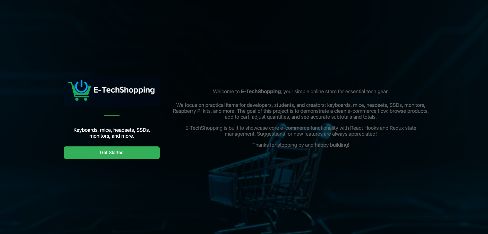
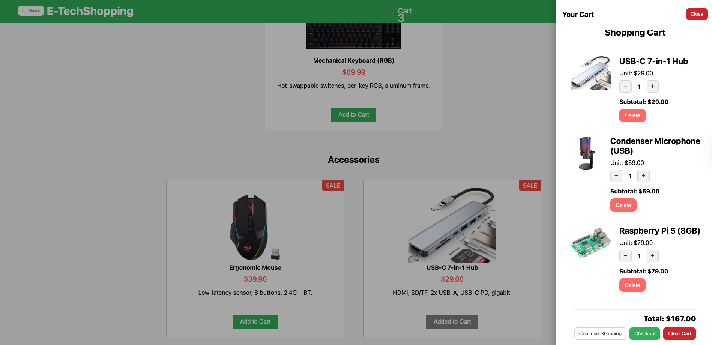

# E-TechShopping

E-TechShopping is a demo application built with **React**, **Redux Toolkit**, and **Vite**.  
The goal of this project is to simulate a basic e-commerce flow, allowing users to browse products, add items to the cart, adjust quantities, and calculate subtotals and totals.

---

## Showcase

### Landing Page


### Shopping Cart


---

## Technologies Used

- **React** for the user interface.
- **Redux Toolkit** for global state management.
- **React Router DOM** for navigation.
- **Vite** as bundler and dev environment.
- **Pure CSS** for styling.

---

## Features

- Landing Page with a "Get Started" button.
- Product listing organized by category.
- Add items to the shopping cart.
- Increment, decrement, and remove items from the cart.
- Automatic subtotal and total calculation.
- Side drawer to view the cart at any time.
- Options to continue shopping, checkout, or clear the cart.

---

## Getting Started

1. Clone the repository:
   ```
   git clone https://github.com/cmontilha/E-TechShopping.git
   cd E-TechShopping
    ```
2. Install dependencies:
    ```
   npm install
    ```
3. Run in development mode:
     ```
   npm run dev
    ```
4. Open in your browser


---

## License

This project is for study and demonstration purposes only.  
Feel free to use it as reference. 

